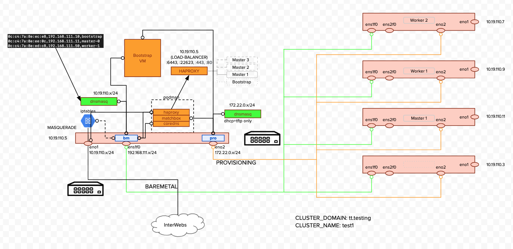

# KNI Automation Framework

The KNI AF provides a series of scripts that simply the deployment of an OCP 4.x cluster.  KNI AF is designed to leverage a prescribed hardware / network setup in order to simplify the deployment process.

The prescribed infrastructure architecture is shown below.



The architecture requires:

* A provisioning/bastion server where several helper applications are run
* One or more hardware nodes for Master Nodes
* Zero or more hardware nodes for Worker Nodes

The provisioning nodes is where the KNI AF is run.

# UPI Background

## Creating the user-provisioned infrastructure

Before you deploy a OpenShift Container Platform cluster that uses user-provisioned infrastructure (UPI), you must create the underlying infrastructure.

### Prerequistes

Review the OpenShift Container Platform 4.x Tested Integrations page before you create the supporting infrastructure for your cluster.

### Quick Start

#### Populate cluster/prep_bm_host.src

* PROV_INTF -- Interface connected to the Provisioning network.  The interface will be added to PROV_BRIDGE
* PROV_BRIDGE -- Name for the internal linux bridge that will be created
* BM_INTF -- Interface connected to the Baremetal network,  The interface will be added to BM_BRIDGE
* BM_BRIDGE -- Name for the internal linux bridge that will be created
* EXT_INTF -- Interface that provides internet connectivity
* PROV_IP_CIDR -- CIDR of the Provisioning network
* BM_IP_CIDR -- CIDR of the Baremetal network

For example...

```bash
   export PROV_INTF=eno2
   export PROV_BRIDGE=provisioning
   export BM_INTF=ens1f0
   export BM_BRIDGE=baremetal
   export EXT_INTF=eno1
   export PROV_IP_CIDR="172.22.0.0/24"
   export BM_IP_CIDR="192.168.111.0/24"
```

#### Populate cluster/install-config.yaml

Populate the hosts: section with information about the hardware hosts you are going to use for the cluster.  

| Field       |  Default     | Definition                           |
| ---------   | ------------ | ------------------------------------ |
| name        | none         | Either master-N or worker-M          |
| role        | none         | Either master|worker|nodeploy        |
| bmc/address | none         | ipmi:/ipaddr                         |
| bmc/credentialsName | none | Name of yaml file containing user/password |
| bootMacAddress | none | MAC address of the provisioning MAC |
| sdnMacAddress  | none | MAC address of the baremetal MAC    |
| hardwareProfile | unused | |
| osProfile/ | | |
| type       | rhcos | OS Type rhcos, centos, or rhel |
| pxe        | bios | boot method, bios or uefi |
| install_dev | sda | DISK to install OS onto... |
| initrd | depends on type | location of initramfs (Should not be set)
| kernel | depends on type | location of boot kernel (Should not be set)
| kickstart | depends on type | kickstart file to use (Should not be set)

When role==**nodeploy**, the host is not provisioned.  **nodeploy** can be used to
temporarily remove / add nodes.

Example below:

```yaml
   hosts:
      # Master nodes are always RHCOS-based
      # You must define either 1 or 3 masters
      -  name: master-0 # Must be of the form master-N or worker-M
         role: master   # Can be either master|worker|nodeploy
         bmc:
            address: ipmi://10.19.110.12
            credentialsName: ha-lab-ipmi
         bootMACAddress: 0C:C4:7A:DB:A9:93  # provisioning network mac
         sdnMacAddress: 0c:c4:7a:19:6f:92   # baremetal network mac
         # sdnIPAddress: 192.168.111.11     # Optional -- Set static IP
         hardwareProfile: default           # NOT USED
         osProfile:
            # With role == master, the osType is always rhcos
            # And with type rhcos, the following are settings are available
            pxe: bios         # pxe boot type either bios (default if not specified) or                      # uefi
                              # all masters must have the same pxe value.  
                              # Either defaulting to bios
                              # or all masters with pxe: uefi
            install_dev: sda  # where to install the operating system (sda is the default)
      -  name: worker-2
         role: worker
         bmc:
            address: ipmi://110.19.110.8
            credentialsName: ha-lab-ipmi
         bootMACAddress: 0C:C4:7A:DB:AC:03
         sdnMacAddress: 0c:c4:7a:19:6f:7e
         hardwareProfile: default
         osProfile:
            type: rhel
            # Don't set the following unless you know what you are doing
            initrd: assets/rhel8/images/pxeboot/initrd.img # (default if not specified)
            kernel: assets/rhel8/images/pxeboot/vmlinuz # (default if not specified)

```

#### Make Procedure

```bash
make clean
make all
make con-start
```

If there are no errors,

```bash
cd terraform/cluster
terraform init
terraform apply --auto-approve
cd ..
cd ..
openshift-install --dir ocp wait-for install-complete
```

Wait for master nodes to deploy

```bash
cd ../workers
terraform init
terraform apply --auto-aprove
```

# Enjoy your OpenShift cluster

## Automation Operation

### Procedure

1. Configure DHCP.  

2. Provision the required load balancers.

3. Configure the ports for your machines.

4. Configure DNS.

5. Ensure network connectivity.

#### DHCP

The KNI AF conditionally instantiates two dnsmasq to provide DHCP for the infrastructure.  The dnsmasq containers provide DHCP for the provisioning network and the network where the OCP SND network resides.  A CoreDNS server is also started to provide DNS services for the cluster.  

#### Load Balancers

The KNI AF conditionally instantiates haproxy as a load balancer for the cluster.  KNI AF can either provide the haproxy load balancer only during install or as a permanent part of the cluster setup.  A load balancer is required for installation.

#### DNS

The KNI AF condistionally instantiates a coredns container to provide mininal DNS support for the cluster.  The coredns server provides an authoritive and recursive DNS server required by OCP.

### Networking requirements for user-provisioned infrastructure

All the Red Hat Enterprise Linux CoreOS (RHCOS) machines require network in initramfs during boot to fetch Ignition config from the Machine Config Server.

During the initial boot, the machines require a DHCP server in order to establish a network connection to download their Ignition config files.

It is recommended to use the DHCP server to manage the machines for the cluster long-term. Ensure that the DHCP server is configured to provide persistent IP addresses and host names to the cluster machines.

The Kubernetes API server must be able to resolve the node names of the cluster machines. If the API servers and worker nodes are in different zones, you can configure a default DNS search zone to allow the API server to resolve the node names. Another acceptable approach is to always refer to hosts by their fully-qualified domain names in both the node objects and all DNS requests.

You must configure the network connectivity between machines to allow cluster components to communicate. Each machine must be able to resolve the host names of all other machines in the cluster.

## Kubernetes API

Host level services, including the node exporter on ports 9100-9101 and the Cluster Version Operator on port 9099.

The default ports that Kubernetes reserves

10256

openshift-sdn

30000-32767

Kubernetes NodePort

## NETWORK TOPOLOGY REQUIREMENTS

The infrastructure that you provision for your cluster must meet the following network topology requirements.

OpenShift Container Platform requires all nodes to have internet access to pull images for platform containers and provide telemetry data to Red Hat.

## Load balancers

Before you install OpenShift Container Platform, you must provision two layer-4 load balancers.

Bootstrap and control plane. You remove the bootstrap machine from the load balancer after the bootstrap machine initializes the cluster control plane.

# Kubernetes API server

22623

Bootstrap and control plane. You remove the bootstrap machine from the load balancer after the bootstrap machine initializes the cluster control plane.

## Machine Config server

443

The machines that run the Ingress router pods, compute, or worker, by default.

HTTPS traffic

80

The machines that run the Ingress router pods, compute, or worker by default.

HTTP traffic

A working configuration for the Ingress router is required for an OpenShift Container Platform cluster. You must configure the Ingress router after the control plane initializes.

# User-provisioned DNS requirements

The following DNS records are required for a OpenShift Container Platform cluster that uses user-provisioned infrastructure. In each record, <cluster_name> is the cluster name and <base_domain> is the cluster base domain that you specify in the install-config.yaml file.

api.<cluster_name>.<base_domain>

This DNS record must point to the load balancer for the control plane machines. This record must be resolvable by both clients external to the cluster and from all the nodes within the cluster.

api-int.<cluster_name>.<base_domain>

This DNS record must point to the load balancer for the control plane machines. This record must be resolvable from all the nodes within the cluster.

The API server must be able to resolve the worker nodes by the host names that are recorded in Kubernetes. If it cannot resolve the node names, proxied API calls can fail, and you cannot retrieve logs from Pods.

Routes

*.apps.<cluster_name>.<base_domain>

A wildcard DNS record that points to the load balancer that targets the machines that run the Ingress router pods, which are the worker nodes by default. This record must be resolvable by both clients external to the cluster and from all the nodes within the cluster.

etcd

etcd-<index>.<cluster_name>.<base_domain>

OpenShift Container Platform requires DNS records for each etcd instance to point to the control plane machines that host the instances. The etcd instances are differentiated by <index> values, which start with 0 and end with n-1, where n is the number of control plane machines in the cluster. The DNS record must resolve to an unicast IPV4 address for the control plane machine, and the records must be resolvable from all the nodes in the cluster.

_etcd-server-ssl._tcp.<cluster_name>.<base_domain>

For each control plane machine, OpenShift Container Platform also requires a SRV DNS record for etcd server on that machine with priority 0, weight 10 and port 2380. A cluster that uses three control plane machines requires the following records:

| _service._proto.name. | TTL | class | SRV | priority | weight | port | target |
| --- | :---: | :---: | :---: | :---: | :---: | :---: | :--- |
|_etcd-server-ssl._tcp.<cluster_name>.<base_domain> | 86400 | IN | SRV | 0 | 10 | 2380 | etcd-0.<cluster_name>.<base_domain>.|
|_etcd-server-ssl._tcp.<cluster_name>.<base_domain> | 86400 | IN | SRV | 0 | 10 | 2380 | etcd-1.<cluster_name>.<base_domain>. |
|_etcd-server-ssl._tcp.<cluster_name>.<base_domain> | 86400 | IN | SRV | 0 | 10 | 2380 | etcd-2.<cluster_name>.<base_domain>.|

| _service._proto.name.                           | TTL  |  class | SRV  | priority  | weight | port  | target. |
| --- | :---: | :---: | :---: | :---: | :---: | :---: | :--- |
|_etcd-server-ssl._tcp.<cluster_name>.<base_domain> | 86400 | IN | SRV | 0 | 10 | 2380 |etcd-0.<cluster_name>.<base_domain>. |
|_etcd-server-ssl._tcp.<cluster_name>.<base_domain> | 86400 | IN | SRV | 0 | 10 | 2380 |etcd-1.<cluster_name>.<base_domain>. |
|_etcd-server-ssl._tcp.<cluster_name>.<base_domain> | 86400 | IN | SRV | 0 | 10 | 2380 |etcd-2.<cluster_name>.<base_domain>. |
